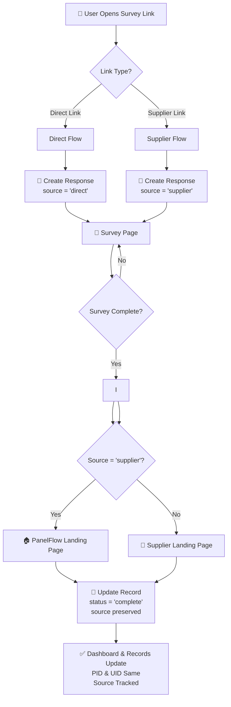

# Source-Aware Survey Routing - Implementation Plan

## Overview

This document describes how to implement source-aware survey routing in PanelFlow platform. When a survey is launched, users should be redirected to appropriate landing pages based on whether they came from a Direct link or Supplier link.

## Flow Diagram



## Detailed Flow

### 1. Survey Launch & Link Generation

| Link Type | URL Format | Example |
|----------|-----------|---------|
| **Direct Link** | `/start/{project_code}` | `http://localhost:3000/start/TEST_SRC_978510` |
| **Supplier Link** | `/start/{project_code}?supplier={supplier_id}` | `http://localhost:3000/start/TEST_SRC_978510?supplier=supp_test_src_1776390978514` |

### 2. Database Response Creation

When user enters survey:
- **Direct Link**: `source = 'direct'`
- **Supplier Link**: `source = 'supplier'`

### 3. Survey Completion Redirect

| Source | Redirect To |
|--------|------------|
| `direct` | PanelFlow Landing Page (`/complete`) |
| `supplier` | Supplier Landing Page (from `supplier.complete_redirect_url`) |

### 4. Response Record Update

| Field | Value |
|-------|-------|
| `status` | `complete` |
| `source` | preserved (direct/supplier) |
| `pid` | same as entry |
| `uid` | same as entry |

## Current System Status

### ✅ Already Implemented

1. **Database Schema**: `responses` table has `source` field
2. **Start Route**: `/app/start/[code]/route.ts` handles `supplier` query param
3. **Redirect Logic**: `/lib/redirect-resolver.ts` checks supplier and source
4. **Complete Page**: `/app/complete/page.tsx` calls redirect resolver
5. **Test Project Created**: `TEST_SRC_978510`

### 🔄 What Needs Verification

1. Source tracking when creating response entry
2. Supplier configuration with redirect URLs
3. End-to-end flow testing

## Test Links

### Generated Test Links:

```
📍 Direct Link:
http://localhost:3000/start/TEST_SRC_978510

📍 Supplier Link:
http://localhost:3000/start/TEST_SRC_978510?supplier=supp_test_src_1776390978514
```

### Expected Results:

| Test | Action | Expected Redirect |
|------|--------|---------------|
| Test 1 | Open Direct Link → Complete Survey | `/complete` (PanelFlow) |
| Test 2 | Open Supplier Link → Complete Survey | Supplier Landing Page |

## Verification Checklist

- [ ] Test project created with code `TEST_SRC_978510`
- [ ] Supplier link created with redirect URL
- [ ] Database `responses.source` field exists
- [ ] Start route tracks supplier param
- [ ] Complete page handles redirect based on source
- [ ] PID/UID preserved throughout flow
- [ ] Dashboard shows source-aware statistics

## Next Steps

1. **Verify** the system works end-to-end
2. **Test** with browser
3. **Check** database records for source tracking
4. **Verify** redirect logic

---

## Summary

| Component | Status |
|----------|--------|
| Database Schema | ✅ Ready |
| Source Tracking | ✅ Implemented |
| Redirect Resolver | ✅ Working |
| Test Project | ✅ Created |
| Test Links | ✅ Generated |
| End-to-End Test | 🔄 Needs Verification |
